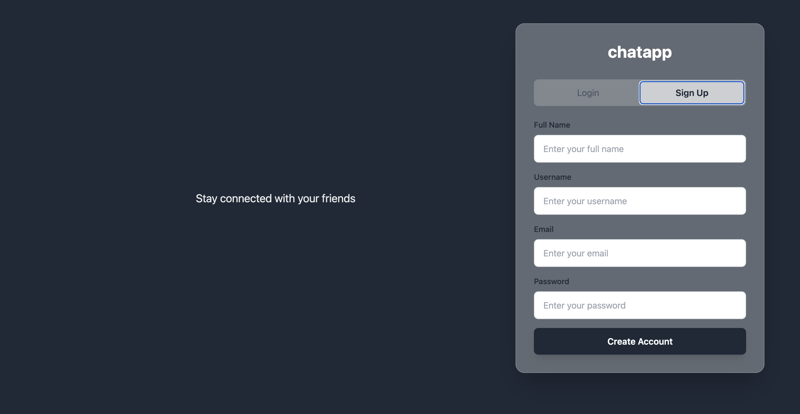
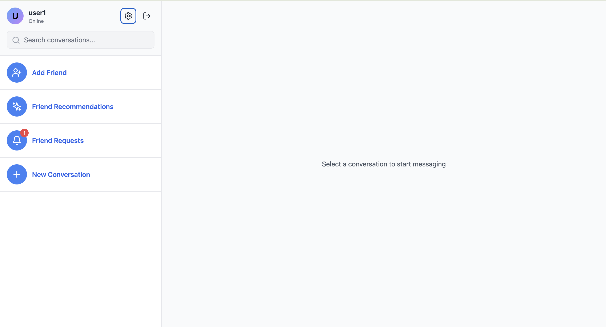
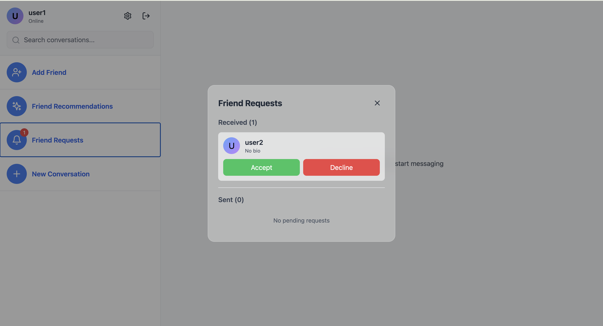
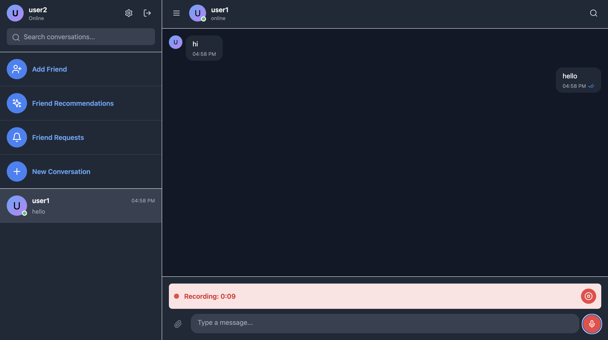
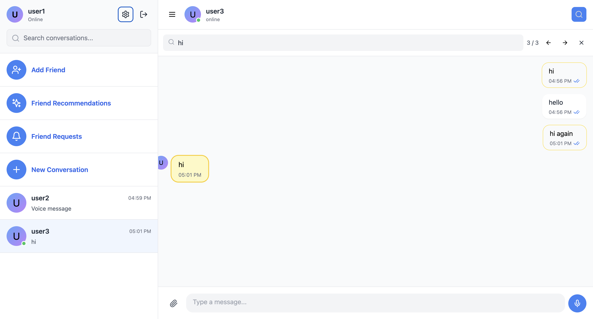
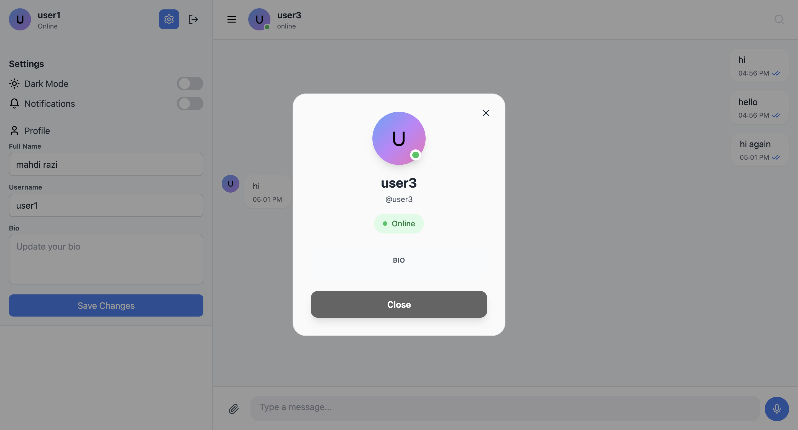

# Chatapp - Real-Time Messaging Platform

A full-stack real-time chat application with a friend recommendation system powered by Graph Attention Networks (GAT), built with React, Node.js, Socket.IO, MongoDB, and Redis.

---

## Overview

ChatApp is a modern messaging platform that enables users to communicate through private chats and group conversations. The application features real-time messaging, voice messages, file sharing, and an intelligent friend recommendation system powered by Graph Attention Networks (GAT).

---

## Layout

These are some screenshots of the app.

<p align="center">
  
  
</p>


<p align="center">
  
  

</p>

<p align="center">
  
  
</p>

---

## Features

### Core Messaging
- Real-time messaging with Socket.IO
- Private one-on-one conversations
- Friend Requests
- Group chat creation and management
- Message status indicators (sent, delivered, read)
- Typing indicators
- Online/offline status tracking
- Voice message recording and playback
- File sharing (up to 25MB)
- In-chat message search functionality

### User Management
- User authentication with JWT
- Profile management
- Friend request system (send, accept, decline, cancel)
- Friend list management
- User search functionality

### Graph Attention Network (GAT) based friend recommendations
- Automatic model retraining every 24 hours
- Personalized suggestions based on user behavior and network patterns

### User Interface
- Dark mode support
- Responsive design (mobile and desktop)
- Real-time notifications
- Conversation search
- Group information panels
- Profile viewing

## Technology Stack

### Backend
- Node.js with Express.js
- Socket.IO for real-time communication
- MongoDB for data persistence
- Redis for caching and session management
- JWT for authentication
- Multer for file uploads
- Bcrypt.js for password hashing

### Frontend
- React 18
- Socket.IO Client


### Machine Learning
- PyTorch with PyTorch Geometric
- Graph Attention Networks (GAT)

### Infrastructure
- Docker and Docker Compose
- MongoDB 7
- Redis 7


## Requirements

### System Requirements
- Docker and Docker Compose installed
- Node.js 18+
- Python 3.x


## Installation

### Using Docker Compose (Recommended)

The project is fully containerized with Docker Compose for easy deployment.

1. Clone the repository:
```bash
git clone https://github.com/Mahdi-Razi-Gandomani/chatapp.git
cd chatapp
```

2. Build and start all services:
```bash
docker-compose up --build
```

3. Access the application:
   - Frontend: http://localhost:3000
   - Backend API: http://localhost:5001
   - MongoDB: localhost:27017 (username: `mrg`, password: `pppppp`)
   - Redis: localhost:6380 (password: `pppppp`)

### Local Development Setup

#### Backend Setup

1. Install system dependencies:
   - Node.js 18+
   - Python 3.x
   - MongoDB 7
   - Redis 7

2. Install Python packages:
```bash
pip3 install torch==2.1.0 numpy==1.24.3 torch-geometric
```

3. Navigate to the backend directory:
```bash
cd backend
```

4. Install Node.js dependencies:
```bash
npm install
```

5. Create `.env` file with your local configuration:
```env
PORT=5001
MONGODB_URI=mongodb://localhost:27017/chatapp
REDIS_HOST=localhost
REDIS_PORT=6379
REDIS_PASSWORD=your-redis-password
JWT_SECRET=your-secret-key
CLIENT_URL=http://localhost:3000
API_URL=http://localhost:5001

```

6. Start MongoDB and Redis services

7. Run the backend server:
```bash
npm start
```


#### Frontend Setup

1. Navigate to the frontend directory:
```bash
cd frontend
```

2. Install dependencies:
```bash
npm install
```

3. Start the development server:
```bash
npm start
```

4. Access the application at http://localhost:3000

## Project Structure

```
chatapp/
├── backend/
│   ├── server.js                 # Main server file with Express and Socket.IO setup
│   ├── gat-service.js            # GAT recommendation service wrapper
│   ├── gat_model.py              # Graph Attention Network implementation
│   ├── package.json              # Backend dependencies
│   ├── Dockerfile                # Backend container configuration
│   ├── models/                   # Directory for trained ML models
│   └── uploads/                  # Directory for uploaded files
│       ├── audio/                # Voice messages
│       └── files/                # General file uploads
├── frontend/
│   ├── src/
│   │   ├── App.js                # Main React component
│   │   └── index.js              # React entry point
│   ├── public/
│   │   └── index.html            # HTML template
│   ├── package.json              # Frontend dependencies
│   └── Dockerfile                # Frontend container configuration
├── .dockerignore
└── docker-compose.yml            # container
```


## API Endpoints

### Authentication
- `POST /api/auth/register` - User registration
- `POST /api/auth/login` - User login

### User Management
- `GET /api/users/me` - Get current user profile
- `PUT /api/users/me` - Update user profile
- `GET /api/users/search` - Search users

### Friends
- `POST /api/friends/request` - Send friend request
- `GET /api/friends/requests/received` - Get received friend requests
- `GET /api/friends/requests/sent` - Get sent friend requests
- `POST /api/friends/request/:requestId/accept` - Accept friend request
- `POST /api/friends/request/:requestId/decline` - Decline friend request
- `DELETE /api/friends/request/:requestId` - Cancel friend request
- `GET /api/friends` - Get friend list
- `GET /api/friends/recommendations` - Get AI-powered friend recommendations

### Conversations
- `GET /api/conversations` - Get user conversations
- `POST /api/conversations/private` - Create/get private conversation
- `POST /api/conversations/group` - Create group conversation
- `POST /api/conversations/:convId/members` - Add members to group
- `POST /api/conversations/:convId/read` - Mark conversation as read
- `GET /api/conversations/:convId/messages` - Get conversation messages

### File Uploads
- `POST /api/upload/audio` - Upload voice message (max 10MB)
- `POST /api/upload/file` - Upload file (max 25MB)

### GAT Model
- `POST /api/gat/train` - Manually trigger model training
- `GET /api/gat/status` - Get model training status

### Health Check
- `GET /health` - Server health status

## Socket.IO Events

### Client to Server
- `message:send` - Send a new message
- `typing:start` - Start typing indicator
- `typing:stop` - Stop typing indicator
- `message:read` - Mark message as read
- `message:delivered` - Confirm message delivery
- `join:conversations` - Join conversation rooms

### Server to Client
- `message:new` - New message received
- `message:status` - Message status update
- `typing:update` - Typing status update
- `user:status` - User online/offline status
- `conversation:new` - New conversation created
- `conversation:updated` - Conversation updated
- `friend:request` - New friend request
- `friend:accepted` - Friend request accepted
- `friend:request:update` - Friend request status changed
- `friend:request:cancelled` - Friend request cancelled

## Configuration

### Environment Variables

#### Backend
- `MONGODB_URI` - MongoDB connection string
- `REDIS_HOST` - Redis host
- `REDIS_PORT` - Redis port
- `REDIS_PASSWORD` - Redis password
- `JWT_SECRET` - Secret key for JWT token generation
- `CLIENT_URL` - Frontend URL for CORS
- `API_URL` - Backend API URL

#### Frontend
The frontend connects to:
- WebSocket: `http://localhost:5001`
- API: `http://localhost:5001`


## GAT Friend Recommendation System

The application uses a Graph Attention Network (GAT) to provide personalized friend recommendations. Unlike traditional recommendation systems, GAT leverages the graph structure of the social network to understand relationships and predict potential connections.

### How It Works

**Graph Representation**
- Users are represented as nodes in a graph
- Existing friendships are represented as edges connecting nodes
- Each user node contains 15 feature dimensions describing their behavior and profile

### Features Used for Recommendations

The model analyzes 15 distinct features per user:

1. **Account age** - Days since account creation
2. **Bio presence** - Whether user has written a bio (1/0)
3. **Avatar presence** - Whether user has uploaded an avatar (1/0)
4. **Total messages** - Cumulative message count
5. **Total conversations** - Number of conversations participated in
6. **Group conversations** - Number of group chats joined
7. **Average message length** - Mean character count per message
8. **Total character count** - Sum of all characters sent
9. **Recent activity** - Messages sent in last 7 days
10. **Morning activity** - Messages sent 6am-12pm
11. **Afternoon activity** - Messages sent 12pm-6pm
12. **Evening activity** - Messages sent 6pm-12am
13. **Night activity** - Messages sent 12am-6am
14. **Friend count** - Number of existing friends
15. **Unique recipients** - Number of distinct users messaged

These features are normalized (z-score normalization) before training to ensure fair weighting.


**Model Architecture**
The GAT model consists of three graph convolutional layers with attention mechanisms:

1. **Layer 1**: Input features (15 dimensions) → 64 hidden units with 4 attention heads
   - Applies attention to learn which neighboring users' features are most relevant
   - Uses ELU activation and layer normalization

2. **Layer 2**: 256 dimensions (64 × 4 heads) → 64 hidden units with 4 attention heads
   - Further refines the representation by aggregating information from 2-hop neighbors
   - Includes dropout (0.3) for regularization

3. **Layer 3**: 256 dimensions → 32 output dimensions with single attention head
   - Produces the final user embedding used for link prediction

**Link Prediction**
After generating embeddings, the model predicts friendship likelihood:
- Concatenates embeddings of two users (64 dimensions total)
- Passes through 3-layer MLP: 64 → 32 → 1
- Outputs a probability score (0-1) indicating friendship potential

**Training Process**
- Positive samples: existing friendships
- Negative samples: randomly sampled non-friend pairs
- Trained for 100 epochs with Adam optimizer (lr=0.001)
- Applies weight decay (5e-4) to prevent overfitting


### Recommendation Generation

When a user requests recommendations:

1. The model generates embeddings for all users in the network
2. For the target user, it calculates friendship probability with all non-friends
3. Scores are ranked from highest to lowest
4. Top-K users are returned with their scores
5. Users with pending friend requests are filtered out

